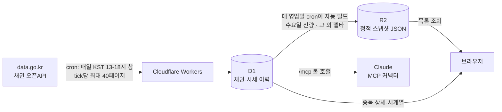

# Bond Screener

공공데이터포털(data.go.kr)이 제공하는 금융위원회 채권 오픈API 2종(채권기본정보 · 채권시세정보)을 기반으로 한 국내 채권 스크리너입니다.

Astro + React Islands로 UI를 구성하고, Cloudflare Workers에 배포합니다. 데이터는 Workers cron이 매일 오픈API에서 수집해 D1에 적재하고, 정기적으로 R2에 정적 스냅샷을 올려 클라이언트에 서빙합니다.

## 프로젝트 구조

오픈API는 개발계정 기준 **일 10,000건** 호출 제한이 있고, 인증키를 클라이언트에 노출할 수도 없습니다. 그래서 클라이언트가 오픈API를 직접 호출하지 않고, Workers가 중간에서 데이터를 미리 수집해 두는 구조를 사용합니다.



- **목록 화면**은 R2 스냅샷만 받습니다 → D1 read 0건.
- **종목 상세·가격 시계열**만 D1을 직접 쿼리합니다(요청당 쿼리 3~4개).
- **`/mcp` 엔드포인트**로 같은 데이터를 Claude에 툴로 노출합니다 ([MCP 서버](#mcp-서버) 참고).
- cron은 매일 **KST 13:00~17:59** 창 안에서 매분 tick마다 최대 40페이지(또는 20초 중 먼저 도달하는 쪽)를 처리합니다 — 오픈API 갱신이 영업일+1일 오후 1시 이후라 그 전에는 돌 필요가 없습니다. 그날 기본정보 수집이 끝나면 다음 tick에서 스크리너 스냅샷도 같은 cron 안에서 이어서 처리됩니다(수요일은 전량 재빌드, 그 외 영업일은 변경분만 담은 델타). 자세한 스케줄링 로직은 [`AGENTS.md`](./AGENTS.md)를 참고하세요.

## 기술 스택

| 영역        | 스택                                                             |
| :---------- | :--------------------------------------------------------------- |
| 프레임워크  | [Astro](https://astro.build) v7 (`output: "server"`)              |
| UI          | React 19 (Astro Islands), [shadcn/ui](https://ui.shadcn.com) (`@base-ui/react` 기반), Phosphor Icons |
| 스타일      | Tailwind CSS v4 (`@tailwindcss/vite`)                             |
| 상태 관리   | TanStack Query v5, TanStack Table                                 |
| 차트        | [lightweight-charts](https://tradingview.github.io/lightweight-charts/) v5 |
| 인프라      | Cloudflare Workers + D1 + R2 (`@astrojs/cloudflare`)              |
| 테스트      | Vitest (`@cloudflare/vitest-plugin`으로 실제 workerd 런타임 위에서 D1/R2 테스트) |
| 툴링        | ESLint, Prettier, lefthook, pnpm                                  |

## 시작하기

### 요구 사항

- Node.js `^22.12.0 || ^24.11.0` (`.node-version`: 24.18.0)
- pnpm — `corepack enable`로 활성화하면 `package.json`에 고정된 버전이 자동으로 사용됩니다(npm·yarn은 지원하지 않습니다).
- 공공데이터포털에서 발급받은 채권 오픈API 인증키
- Cloudflare 계정 (배포 및 원격 D1/R2 사용 시 필요)

### 설치

```bash
pnpm install
```

`pnpm install` 시 `prepare` 스크립트가 lefthook을 자동으로 설치합니다.

### 인증키 설정

프로젝트 루트에 `.dev.vars` 또는 `.env` 파일을 만들고 **Decoded 인증키**를 넣으세요. 두 파일이 모두 있으면 `.dev.vars`가 우선하며 `.env`는 무시됩니다.

```ini
BOND_API_SERVICE_KEY="발급받은-인증키"
MCP_AUTH_TOKEN="임의의-긴-난수-문자열"
```

`MCP_AUTH_TOKEN`은 `/mcp` 엔드포인트의 **rate limit 면제 키**입니다(선택 사항). 값은 자유롭게 정하면 됩니다(`openssl rand -hex 32` 등). 설정하지 않아도 `/mcp`는 그대로 동작하며, 면제 수단만 없어집니다 — 자세한 내용은 [MCP 서버](#mcp-서버)를 참고하세요.

> 두 파일 모두 `.gitignore` 대상입니다. 배포된 Worker에는 전달되지 않으므로, 배포 시에는 별도로 `wrangler secret put BOND_API_SERVICE_KEY`와 `wrangler secret put MCP_AUTH_TOKEN`을 실행해야 합니다.

### Cloudflare 리소스 준비

[`wrangler.jsonc`](./wrangler.jsonc)에는 이 저장소를 운영 중인 계정 소유의 D1 데이터베이스 ID와 배포 도메인이 들어 있습니다. 자신의 Cloudflare 계정으로 배포하려면 먼저 리소스를 새로 만들고 값을 교체해야 합니다.

```bash
wrangler d1 create bond-screener
wrangler r2 bucket create bond-screener-archive
```

| 파일                | 키                             | 설명                                                                    |
| :------------------ | :------------------------------ | :------------------------------------------------------------------------ |
| `wrangler.jsonc`     | `name`                          | Worker 이름 — 원하는 이름으로 변경                                        |
| `wrangler.jsonc`     | `d1_databases[0].database_id`   | `wrangler d1 create` 출력값으로 교체                                      |
| `wrangler.jsonc`     | `routes[0].pattern`             | 커스텀 도메인이 있으면 자신의 도메인으로, 없으면 `routes`를 지우고 `workers_dev: true`로 |
| `astro.config.mjs`   | `site`                          | sitemap 생성 기준 URL — 배포 도메인에 맞춰 변경                            |

`ratelimits[0].namespace_id`는 별도로 생성하는 리소스가 아니라 계정 내에서 임의로 고유하게 붙이는 식별자이므로 그대로 두어도 됩니다.

값을 정리했다면 마이그레이션을 적용합니다:

```bash
pnpm db:migrate
```

### 로컬 데이터 채우기

로컬 D1/R2를 채우려면 오픈API에서 원본 데이터를 먼저 수집해야 합니다. `.backfill/`은 git에 포함되지 않으므로 클론 직후에는 비어 있습니다.

```bash
pnpm backfill discover-range                   # 시세 API 보존 한계 탐지 (최초 1회)
pnpm backfill fetch issu  --bas-dt YYYYMMDD    # 기본정보 원본 수집 (D1 미적재)
pnpm backfill fetch price                      # 시세 원본 수집 (D1 미적재)
pnpm backfill build-sql --source issu
pnpm backfill build-sql --source price
pnpm db:reset:local && pnpm seed:local         # 로컬 D1/R2 초기화 → 마이그레이션 → 적용 → 스냅샷 빌드
```

- `fetch`는 오픈API 일일 쿼터(개발계정 기준 10,000건)를 소모하므로, 특히 시세 전량 수집은 여러 날에 나눠 돌려야 할 수 있습니다. 중간에 끊겨도 같은 명령을 다시 실행하면 `.backfill/state.json`에 기록된 지점부터 이어집니다.
- `fetch`(API 쿼터)와 `apply`(D1 write 한도)를 분리해 둔 이유는 한쪽이 한도에 걸려도 다른 쪽까지 다시 돌리지 않기 위해서입니다.
- 데이터 수집 없이 화면만 확인하고 싶다면 `pnpm test:e2e`가 사용하는 E2E 전용 픽스처(`scripts/seed-e2e.mjs`)로 최소한의 데이터를 채울 수 있습니다.

### 개발 서버

```bash
pnpm dev
```

`localhost:4321`에서 실행됩니다.

## 명령어

모든 명령은 프로젝트 루트에서 실행합니다.

### 개발 · 빌드

| 명령                  | 설명                                                     |
| :-------------------- | :------------------------------------------------------- |
| `pnpm dev`            | 개발 서버 시작 (`localhost:4321`)                        |
| `pnpm build`          | 프로덕션 빌드 (`./dist/`)                                |
| `pnpm preview`        | 빌드 결과 로컬 미리보기                                  |
| `pnpm lint`           | ESLint 실행                                              |
| `pnpm format`         | Prettier 포매팅 (`.prettierignore`에 `*.md` 포함)        |
| `pnpm test`           | Vitest watch 모드 (node/browser/workers 3-프로젝트)      |
| `pnpm test --run`     | Vitest 1회 실행 (CI/pre-push 훅과 동일)                  |
| `pnpm test:e2e`       | Playwright E2E (E2E 전용 로컬 D1을 먼저 시딩)            |
| `pnpm generate-types` | `wrangler.jsonc` 기반 바인딩 타입 생성                   |

### 데이터베이스 · 데이터

| 명령                                    | 설명                                          |
| :-------------------------------------- | :--------------------------------------------- |
| `pnpm db:migrate`                       | 원격 D1에 마이그레이션 적용                    |
| `pnpm db:migrate:local`                 | 로컬 D1에 마이그레이션 적용                    |
| `pnpm db:reset:local`                   | 로컬 D1/R2 상태 삭제                           |
| `pnpm seed:local`                       | 로컬 마이그레이션 + 백필 + 스냅샷 일괄 실행    |
| `pnpm backfill <subcommand>`            | 초기 백필 CLI (아래 참고)                      |
| `pnpm snapshot -- --remote \| --local`  | 스크리너 목록 스냅샷 빌드 (**타깃 명시 필수**) |
| `pnpm snapshot:local`                   | `pnpm snapshot -- --local` 지름길              |

`pnpm backfill` 서브커맨드:

```bash
pnpm backfill discover-range
pnpm backfill fetch issu  [--bas-dt YYYYMMDD]
pnpm backfill fetch price [--from YYYYMMDD] [--to YYYYMMDD]
pnpm backfill build-sql --source issu|price
pnpm backfill apply --source issu|price --remote|--local [--budget 90000]
pnpm backfill status
```

`--remote`는 `.backfill/state.json`에 적용 이력과 D1 free tier 일일 write 예산을 기록하고 확인합니다. `--local`은 이 장부를 보지 않고 매번 전체 청크를 재적용합니다(생성되는 SQL이 모두 `ON CONFLICT DO NOTHING`이라 안전합니다).

### 배포

```bash
pnpm deploy   # astro build && wrangler deploy
```

원격 상태 확인:

```bash
wrangler secret list --config ./wrangler.jsonc
wrangler d1 migrations list bond-screener --remote --config ./wrangler.jsonc
```

> D1/R2 관련 wrangler 명령에는 항상 `--config ./wrangler.jsonc`를 명시하세요 — 빌드 산출물(`dist/server/wrangler.json`)로 리다이렉트되는 것을 피하기 위함입니다.

CI(`.github/workflows/ci.yml`)는 타입체크·린트·테스트·e2e·빌드를 확인하는 용도로만 사용되며 배포는 수행하지 않으므로, 배포는 위 `pnpm deploy` 또는 별도로 구성한 CD 파이프라인에서 진행해야 합니다.

## 프로젝트 구조

```text
docs/api/         # 오픈API 2종 명세 문서 (src/api/와 1:1 대응)
migrations/       # D1 스키마 마이그레이션
scripts/          # 초기 백필·스냅샷 빌드 CLI (Node ESM, 무의존성)
src/
  api/            # 오픈API 요청/응답 타입·상수 (와이어 포맷 그대로, 로직 없음)
  components/
    bond/         # 종목 상세 · 가격 차트
    common/       # 공용 소품 컴포넌트 (ErrorState 등)
    layout/       # 두 island가 공유하는 헤더(AppHeader) · 테마 토글(ThemeToggle)
    screener/     # 스크리너 목록 · 필터 · 정렬 · 페이지네이션 (TanStack Table 기반)
    providers/    # QueryProvider 등 island 내부 컨텍스트
    ui/           # shadcn/ui 컴포넌트
  hooks/          # useScreenerData, useBondPrices, useScreenerViewState
  layouts/        # Astro 레이아웃
  lib/
    openapi/      # 공통 fetch 클라이언트, 오류 분류, 값 정규화
    bond/         # 컬럼 순서 정본, 매핑, 변경 감지 지문, 상세 응답 변환
    d1/           # D1 읽기·쓰기 repo, json_each 벌크 upsert SQL 생성
    api/          # /api/* 라우트 공용 입력 검증·응답 헬퍼
    sync/         # cron tick 오케스트레이션, 순수 스케줄링 로직
    r2/           # R2 키 네이밍, 아카이브, 시세 델타 스냅샷
    snapshot/     # 목록 스냅샷 v2 포맷·인코드·디코드·병합
    mcp/          # MCP 서버 팩토리·툴 3종 정의·응답 포맷·공유 시크릿 인증
    screener/     # 스크리너 필터·정렬·프리셋 상태 및 순수 변환 로직 (hook과 컴포넌트가 공유)
  pages/
    api/          # 서버 API 라우트 (snapshot 프록시, bond/[id] 상세·시계열)
    mcp.ts        # MCP 엔드포인트 — 라우팅·CORS·rate limit·인증 게이트만
  worker.ts       # Workers 진입점 (fetch 위임 + scheduled)
tests/            # Vitest 3-프로젝트 (node/browser/workers) + e2e/ (Playwright)
```

## API 라우트

| 라우트                      | 설명                                                          |
| :--------------------------- | :--------------------------------------------------------------- |
| `GET /api/snapshot/[...path]` | R2 스냅샷 스트리밍 패스스루 (목록 데이터)                     |
| `GET /api/bond/[id]`          | 종목 상세 — `bond` 전체 컬럼 + `bond_state` 이력 + 최신 시세  |
| `GET /api/bond/[id]/prices`   | 가격 시계열 — `from`/`to`(기본 최근 1년)·`market` 필터        |

`id`는 12자리 ISIN 또는 9자리 단축코드(`srtnCd`) 모두 지원합니다.

## MCP 서버

`POST /mcp`가 채권 데이터를 [MCP(Model Context Protocol)](https://modelcontextprotocol.io) 툴로 노출합니다. Claude(웹·데스크톱·모바일 공통)의 **커스텀 커넥터**에 URL을 등록하면 대화 중에 종목을 검색·조회할 수 있습니다.

`@modelcontextprotocol/server`(SDK v2)의 `createMcpHandler`로 구현한 **stateless Streamable HTTP** 서버입니다 — Durable Object도 세션도 없이, 요청마다 새 `McpServer` 인스턴스를 만들어 요청 간 상태가 섞이지 않습니다.

### 툴

| 툴                | 설명                                                                     |
| :---------------- | :----------------------------------------------------------------------- |
| `search_bonds`    | 조건 검색 — 발행인·종목명·채권종류·만기·표면이율·신용등급·발행잔액·최근 거래 여부 |
| `get_bond`        | 종목 상세 (`verbose: true`면 신용등급 이력 + 전체 발행조건 75개 필드)    |
| `get_bond_prices` | 일별 시세 시계열 (`from`/`to`·`market` 필터, 최대 1,000행)               |

`search_bonds` 인자:

| 인자                          | 설명                                                              |
| :---------------------------- | :----------------------------------------------------------------- |
| `issuer` · `name`             | 발행인명 · 종목명 부분일치                                        |
| `kind`                        | 채권 종류 — 한글 라벨(`국채`/`지방채`/`특수채`/`지방공사채`/`금융채`/`유동화SPC채`/`유사집합투자기구채`/`일반회사채`/`MBS`/`SLBS`) |
| `maturityFrom` · `maturityTo` | 만기일 범위 (YYYYMMDD)                                            |
| `couponMin` · `couponMax`     | 표면이율(%) 범위                                                  |
| `grade` · `minGrade`          | KIS 신용등급 — 화이트리스트 또는 하한(`AA-`면 `AAA`~`AA-`). 함께 주면 교집합 |
| `balanceMin`                  | 발행잔액 하한(원)                                                 |
| `tradedSince`                 | 이 날짜 이후 거래 기록이 있는 종목만 (YYYYMMDD)                   |
| `sort`                        | `exprDt`(기본) · `bondBal` · `coupon` · `volume`                  |
| `limit`                       | 기본 20, 최대 50                                                  |

신용등급은 **KIS(한국신용평가) 기준만** 노출합니다. 중간 등급 표기는 `AA`가 아니라 `AA0`입니다(`A0`/`BBB0`/`BB0`/`B0`도 마찬가지입니다).

`sort: "volume"`은 각 종목이 **마지막으로 거래된 날**의 거래량을 기준으로 정렬하므로, 오래전 대량 거래가 상위에 올 수 있습니다 — 최근 활발한 종목을 찾으려면 `tradedSince`와 함께 사용하세요. 상장 종목 대부분은 거래가 드뭅니다.

> `search_bonds`만 D1을 직접 검색합니다(스크리너 목록 조회는 R2 스냅샷을 사용하므로 D1 read가 0건입니다). 발행인·종목명 검색은 `bond` 테이블 전체 스캔이고 거래량 정렬은 `bond_price`를 종목별 PK 시크로 조회합니다 — 호출 빈도가 사람 대화 수준임을 고려한 트레이드오프입니다.

### 인증 — 선택 사항

**인증은 필수가 아닙니다.** 토큰의 역할은 접근 통제가 아니라 **rate limit 면제**입니다 — 노출되는 데이터가 이미 스크리너 화면과 `/api/bond/*`로 공개되어 있어, 익명 접근이 새로운 정보를 노출하지 않기 때문입니다.

| 요청 | 결과 |
| :--- | :--- |
| 헤더 없음 | 통과 — 단 **IP당 분당 30회** 한도 적용 |
| 올바른 토큰 | 통과 — **한도 면제** |
| 틀린 토큰 | `401` (한도도 함께 소비됩니다) |

토큰은 다음 두 헤더 중 하나로 전달합니다:

```
authorization: Bearer <MCP_AUTH_TOKEN>
x-mcp-token: <MCP_AUTH_TOKEN>     # Authorization을 예약어로 막는 클라이언트용 (접두사 없음)
```

`Authorization` 헤더가 있으면 대체 헤더는 무시됩니다. 토큰 비교는 SHA-256 다이제스트 간 상수 시간 비교로 이뤄집니다.

> 틀린 토큰을 익명으로 강등하지 않고 401로 거부하는 이유는, 오래된 토큰이나 배포 누락이 "왜 자꾸 429가 나지"처럼 조용히 숨는 것보다 호출자가 바로 알아차리는 편이 낫기 때문입니다. 대신 401을 반환하기 **전에** 한도를 소비해, 토큰 무차별 대입 시도가 한도 없이 반복되지 않도록 막습니다.

`MCP_AUTH_TOKEN`을 등록하지 않으면 면제 수단이 없을 뿐, 엔드포인트는 그대로 공개 상태로 동작합니다(이때 토큰을 보내면 검증할 수 없으므로 401이 반환됩니다).

### Claude 커넥터 등록

설정 → 커넥터 → 커스텀 커넥터 추가:

- **URL** — `https://bond-screener.ptcookie.net/mcp` (자신의 도메인으로 배포했다면 그 주소로 교체)
- **인증** — "없음"으로 두면 익명(분당 30회 한도)으로 연결됩니다.
- **요청 헤더**(선택) — 한도를 면제받으려면 `Authorization` 헤더에 `Bearer <MCP_AUTH_TOKEN>`을 등록하세요.

### 로컬 검증

```bash
# 익명 (헤더 없이) — 200이 반환되어야 합니다
curl -s -X POST http://localhost:4321/mcp \
  -H 'content-type: application/json' \
  -H 'accept: application/json, text/event-stream' \
  -d '{"jsonrpc":"2.0","id":1,"method":"tools/list"}'

# 한도 면제 경로 — 위 명령에 헤더 하나만 추가
#   -H "authorization: Bearer $MCP_AUTH_TOKEN"
```

또는 [MCP Inspector](https://github.com/modelcontextprotocol/inspector)로 연결할 수 있습니다(헤더는 선택 사항입니다):

```bash
npx @modelcontextprotocol/inspector@latest
```

> `tools/call` 응답은 기본 설정(`responseMode: "auto"`)에서 SSE(`data: {...}` 프레임)로 전달됩니다 — 일반 JSON 파서만으로는 처리할 수 없습니다.

> **429는 로컬에서 재현되지 않습니다.** Cloudflare Rate Limiting 바인딩에는 로컬 시뮬레이터가 없어, 로컬에서는 몇 번을 호출해도 제한되지 않습니다. 한도 동작은 배포 후 프로덕션에서만 확인할 수 있습니다.

## 오픈API 참고

- 전체 필드·파라미터 명세: [`docs/api/README.md`](./docs/api/README.md), [`docs/api/bond-issu-info.md`](./docs/api/bond-issu-info.md), [`docs/api/bond-price-info.md`](./docs/api/bond-price-info.md)
- 대응하는 TypeScript 타입: [`src/api/`](./src/api/)

주의할 점 몇 가지:

- **API 레벨 오류도 HTTP 200으로 응답합니다.** 반드시 `response.header.resultCode === "00"`인지 확인하세요. 단 게이트웨이 레벨 오류(인증키 문제 등)는 401/403 상태 코드와 별도 봉투(`OpenAPI_ServiceResponse`)로 전달됩니다.
- `resultType` 기본값은 `xml`입니다. JSON 응답을 받으려면 매 요청에 `resultType=json`을 명시해야 합니다.
- 조회 결과가 0건이면 `items`가 객체가 아니라 **빈 문자열**(`""`)로 옵니다.
- 데이터는 하루 한 번, **기준일자 기준 영업일 +1일 오후 1시 이후** 갱신됩니다.
- 두 API의 베이스 URL이 다릅니다 — 시세정보 쪽 경로에만 `/service/`가 붙습니다.

## 라이선스

코드는 [MIT License](./LICENSE)를 따릅니다.

데이터 라이선스는 별도입니다:

- **채권기본정보** — 공공누리 **제2유형**(출처표시 + **상업적 이용금지**)을 따릅니다. 상업적으로 활용하려면 원천 소유자인 한국예탁결제원(KSD)과 별도 정보이용계약이 필요합니다(portal@ksd.or.kr).
- **채권시세정보** — 이용허락범위에 제한이 없습니다.

서비스를 공개하거나 수익화할 계획이라면 기본정보 쪽 라이선스 제약을 먼저 확인하세요. [MCP 서버](#mcp-서버)로 노출되는 데이터도 같은 제약을 받습니다 — 웹 화면과 동일한 데이터이며, MCP를 통한다고 해서 별도의 이용 범위가 생기지는 않습니다.

## 기여 · 개발 가이드

아키텍처 결정 배경, 알려진 이슈(빌드 툴체인 우회, D1 write 회계, 백필 스크립트 이중 구현 정합성 등)와 상세 컨벤션은 [`AGENTS.md`](./AGENTS.md)에 정리되어 있습니다.

git 훅(lefthook)이 설정되어 있습니다:

- **pre-commit** — staged 파일에 `tsc --noEmit` + ESLint + Prettier
- **pre-push** — `pnpm test --run`
