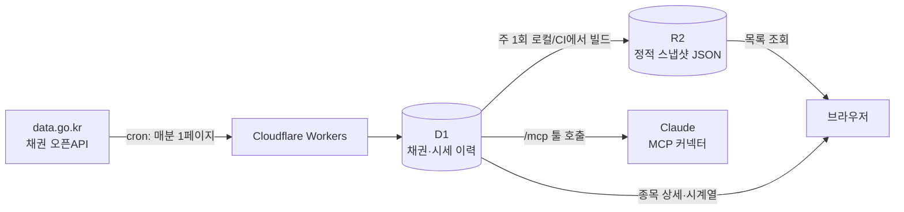

# Bond Screener

공공데이터포털(data.go.kr)이 제공하는 금융위원회 채권 오픈API 2종(채권기본정보 · 채권시세정보)을 기반으로 한 국내 채권 스크리너.

Astro + React Islands로 UI를 구성하고, Cloudflare Workers에 배포한다. 데이터는 Workers cron이 매일 오픈API에서 수집해 D1에 적재하고, 주기적으로 R2에 정적 스냅샷을 올려 클라이언트에 서빙한다.

## 왜 이런 구조인가

오픈API는 개발계정 기준 **일 10,000건** 호출 제한이 있고, 인증키를 클라이언트에 노출할 수도 없다. 그래서 클라이언트가 오픈API를 직접 호출하지 않고, Workers가 중간에서 데이터를 미리 긁어두는 구조를 택했다.



- **목록 화면**은 R2 스냅샷만 받는다 → D1 read 0건.
- **종목 상세·가격 시계열**만 D1을 직접 쿼리한다(요청당 쿼리 3~4개).
- **`/mcp` 엔드포인트**로 같은 데이터를 Claude에 툴로 노출한다 ([MCP 서버](#mcp-서버) 참고).
- cron은 **1 tick(1분)에 정확히 1페이지**만 처리한다 — Workers Free tier의 CPU 10ms 예산에 맞추기 위함.

## 기술 스택

| 영역        | 스택                                                             |
| :---------- | :--------------------------------------------------------------- |
| 프레임워크  | [Astro](https://astro.build) v7 (`output: "server"`)              |
| UI          | React 19 (Astro Islands), [shadcn/ui](https://ui.shadcn.com) (`@base-ui/react` 기반), Phosphor Icons |
| 스타일      | Tailwind CSS v4 (`@tailwindcss/vite`)                             |
| 상태 관리   | TanStack Query v5, TanStack Table                                 |
| 차트        | [lightweight-charts](https://tradingview.github.io/lightweight-charts/) v5 |
| 인프라      | Cloudflare Workers + D1 + R2 (`@astrojs/cloudflare`)              |
| 테스트      | Vitest (`@cloudflare/vitest-plugin`으로 실제 workerd 런타임 위 D1/R2 테스트) |
| 툴링        | ESLint, Prettier, lefthook, pnpm                                  |

## 시작하기

### 요구 사항

- Node.js `^22.12.0 || ^24.11.0` (`.node-version`: 24.18.0)
- pnpm (npm/yarn 사용 금지)
- 공공데이터포털에서 발급받은 채권 오픈API 인증키
- Cloudflare 계정 (배포 및 원격 D1/R2 사용 시)

### 설치

```bash
pnpm install
```

`pnpm install` 시 `prepare` 스크립트가 lefthook을 자동 설치한다.

### 인증키 설정

프로젝트 루트에 `.dev.vars` 또는 `.env` 파일을 만들고 **Decoded 인증키**를 넣는다. 두 파일이 모두 있으면 `.dev.vars`가 우선하며 `.env`는 무시된다.

```ini
BOND_API_SERVICE_KEY="발급받은-인증키"
MCP_AUTH_TOKEN="임의의-긴-난수-문자열"
```

`MCP_AUTH_TOKEN`은 `/mcp` 엔드포인트의 **rate limit 면제 키**다(선택). 값은 직접 정하면 된다(`openssl rand -hex 32` 등). 없어도 `/mcp`는 동작하며, 면제 수단만 사라진다 — [MCP 서버](#mcp-서버) 참고.

> 두 파일 모두 `.gitignore` 대상이다. 배포된 Worker에는 전달되지 않으므로, 배포 시에는 별도로 `wrangler secret put BOND_API_SERVICE_KEY`와 `wrangler secret put MCP_AUTH_TOKEN`을 실행해야 한다.

### 로컬 데이터 채우기

로컬 개발용 D1/R2를 채우려면 (`.backfill/`에 수집된 청크가 이미 있어야 한다):

```bash
pnpm db:reset:local && pnpm seed:local
```

로컬 D1/R2 상태 초기화 → 마이그레이션 → 채권기본정보·시세정보 전량 적용 → 스냅샷 빌드까지 한 번에 실행된다.

### 개발 서버

```bash
pnpm dev
```

`localhost:4321`에서 실행된다.

## 명령어

모든 명령은 프로젝트 루트에서 실행한다.

### 개발 · 빌드

| 명령                  | 설명                                                     |
| :-------------------- | :------------------------------------------------------- |
| `pnpm dev`            | 개발 서버 시작 (`localhost:4321`)                        |
| `pnpm build`          | 프로덕션 빌드 (`./dist/`)                                |
| `pnpm preview`        | 빌드 결과 로컬 미리보기                                  |
| `pnpm lint`           | ESLint 실행                                              |
| `pnpm format`         | Prettier 포매팅 (`.prettierignore`에 `*.md` 포함)        |
| `pnpm test`           | Vitest watch 모드                                        |
| `pnpm test --run`     | Vitest 1회 실행 (CI/pre-push 훅과 동일)                  |
| `pnpm generate-types` | `wrangler.jsonc` 기반 바인딩 타입 생성                   |

### 데이터베이스 · 데이터

| 명령                                    | 설명                                          |
| :-------------------------------------- | :-------------------------------------------- |
| `pnpm db:migrate`                       | 원격 D1에 마이그레이션 적용                   |
| `pnpm db:migrate:local`                 | 로컬 D1에 마이그레이션 적용                   |
| `pnpm db:reset:local`                   | 로컬 D1/R2 상태 삭제                          |
| `pnpm seed:local`                       | 로컬 마이그레이션 + 백필 + 스냅샷 일괄 실행   |
| `pnpm backfill <subcommand>`            | 초기 백필 CLI (아래 참고)                     |
| `pnpm snapshot -- --remote \| --local`  | 스크리너 목록 스냅샷 빌드 (**타깃 명시 필수**) |
| `pnpm snapshot:local`                   | `pnpm snapshot -- --local` 지름길             |

`pnpm backfill` 서브커맨드:

```bash
pnpm backfill discover-range
pnpm backfill fetch issu  [--bas-dt YYYYMMDD]
pnpm backfill fetch price [--from YYYYMMDD] [--to YYYYMMDD]
pnpm backfill build-sql --source issu|price
pnpm backfill apply --source issu|price --remote|--local [--budget 90000]
pnpm backfill status
```

`--remote`는 `.backfill/state.json`에 적용 이력과 D1 free tier 일일 write 예산을 기록·체크한다. `--local`은 이 장부를 보지 않고 매번 전체 청크를 재적용한다(생성 SQL이 전부 `ON CONFLICT DO NOTHING`이라 안전).

### 배포

```bash
pnpm deploy   # astro build && wrangler deploy
```

원격 상태 확인:

```bash
wrangler secret list --config ./wrangler.jsonc
wrangler d1 migrations list bond-screener --remote --config ./wrangler.jsonc
```

> D1/R2 관련 wrangler 명령에는 항상 `--config ./wrangler.jsonc`를 명시한다 — 빌드 산출물(`dist/server/wrangler.json`)로 리다이렉트되는 것을 피하기 위함이다.

## 프로젝트 구조

```text
docs/api/         # 오픈API 2종 명세 문서 (src/api/와 1:1 대응)
migrations/       # D1 스키마 마이그레이션
scripts/          # 초기 백필·스냅샷 빌드 CLI (Node ESM, 무의존성)
src/
  api/            # 오픈API 요청/응답 타입·상수 (와이어 포맷 그대로, 로직 없음)
  components/
    bond/         # 종목 상세 · 가격 차트
    screener/     # 스크리너 목록 · 필터 · 정렬 · 페이지네이션
    providers/    # QueryProvider 등 island 내부 컨텍스트
    ui/           # shadcn/ui 컴포넌트
  hooks/          # useScreenerData, useBondPrices, useScreenerViewState
  layouts/        # Astro 레이아웃
  lib/
    openapi/      # 공통 fetch 클라이언트, 오류 분류, 값 정규화
    bond/         # 컬럼 순서 정본, 매핑, 변경 감지 지문, 상세 응답 변환
    d1/           # D1 읽기·쓰기 repo, json_each 벌크 upsert SQL 생성
    api/          # /api/* 라우트 공용 입력 검증·응답 헬퍼
    sync/         # cron tick 오케스트레이션, 순수 스케줄링 로직
    r2/           # R2 키 네이밍, 아카이브, 시세 델타 스냅샷
    snapshot/     # 목록 스냅샷 v2 포맷·인코드·디코드·병합
    mcp/          # MCP 서버 팩토리·툴 3종 정의·응답 포맷·공유 시크릿 인증
  pages/
    api/          # 서버 API 라우트 (snapshot 프록시, bond/[id] 상세·시계열)
    mcp.ts        # MCP 엔드포인트 — 라우팅·CORS·rate limit·인증 게이트만
  worker.ts       # Workers 진입점 (fetch 위임 + scheduled)
tests/            # Vitest (node 프로젝트) + tests/workers/ (workerd 런타임)
```

## API 라우트

| 라우트                      | 설명                                                          |
| :-------------------------- | :------------------------------------------------------------ |
| `GET /api/snapshot/[...path]` | R2 스냅샷 스트리밍 패스스루 (목록 데이터)                    |
| `GET /api/bond/[id]`          | 종목 상세 — `bond` 전체 컬럼 + `bond_state` 이력 + 최신 시세 |
| `GET /api/bond/[id]/prices`   | 가격 시계열 — `from`/`to`(기본 최근 1년)·`market` 필터       |

`id`는 12자리 ISIN 또는 9자리 단축코드(`srtnCd`) 둘 다 받는다.

## MCP 서버

`POST /mcp`가 채권 데이터를 [MCP(Model Context Protocol)](https://modelcontextprotocol.io) 툴로 노출한다. Claude(웹·데스크톱·모바일 공통)의 **커스텀 커넥터**에 URL을 그대로 등록하면 대화 중에 종목을 검색·조회할 수 있다.

`@modelcontextprotocol/server`(SDK v2)의 `createMcpHandler`로 구현한 **stateless Streamable HTTP**다 — Durable Object도 세션도 없고, 요청마다 새 `McpServer` 인스턴스를 만들어 요청 간 상태가 섞이지 않는다.

### 툴

| 툴                | 설명                                                                     |
| :---------------- | :----------------------------------------------------------------------- |
| `search_bonds`    | 조건 검색 — 발행인·종목명·채권종류·만기·표면이율·신용등급·발행잔액·최근 거래 여부 |
| `get_bond`        | 종목 상세 (`verbose: true`면 신용등급 이력 + 전체 발행조건 75개 필드)    |
| `get_bond_prices` | 일별 시세 시계열 (`from`/`to`·`market` 필터, 최대 1,000행)               |

`search_bonds` 인자:

| 인자                          | 설명                                                              |
| :---------------------------- | :----------------------------------------------------------------- |
| `issuer` · `name`             | 발행인명 · 종목명 부분일치                                        |
| `kind`                        | 채권 종류 — 한글 라벨(`국채`/`지방채`/`특수채`/`지방공사채`/`금융채`/`유동화SPC채`/`유사집합투자기구채`/`일반회사채`/`MBS`/`SLBS`) |
| `maturityFrom` · `maturityTo` | 만기일 범위 (YYYYMMDD)                                            |
| `couponMin` · `couponMax`     | 표면이율(%) 범위                                                  |
| `grade` · `minGrade`          | KIS 신용등급 — 화이트리스트 또는 하한(`AA-`면 `AAA`~`AA-`). 함께 주면 교집합 |
| `balanceMin`                  | 발행잔액 하한(원)                                                 |
| `tradedSince`                 | 이 날짜 이후 거래 기록이 있는 종목만 (YYYYMMDD)                   |
| `sort`                        | `exprDt`(기본) · `bondBal` · `coupon` · `volume`                  |
| `limit`                       | 기본 20, 최대 50                                                  |

신용등급은 **KIS(한국신용평가) 기준만** 노출한다. 중간 등급 표기는 `AA`가 아니라 `AA0`다(`A0`/`BBB0`/`BB0`/`B0`도 마찬가지).

`sort: "volume"`은 각 종목이 **마지막으로 거래된 날**의 거래량 기준이라, 오래전 대량 거래가 상위에 올 수 있다 — 최근 활발한 종목을 찾으려면 `tradedSince`와 함께 쓴다. 상장 종목 대부분은 거래가 드물다.

> `search_bonds`만 D1을 직접 검색한다(스크리너 목록 조회는 R2 스냅샷이라 D1 read 0건). 발행인·종목명 LIKE는 `bond` 테이블 전체 스캔이고 거래량 정렬은 `bond_price`를 종목별 PK 시크로 훑는다 — 호출 빈도가 사람 대화 수준이라 감내하는 트레이드오프다.

### 인증 — 선택 사항

**인증은 필수가 아니다.** 토큰의 역할은 접근 통제가 아니라 **rate limit 면제**다 — 노출되는 데이터가 이미 스크리너 화면·`/api/bond/*`로 공개돼 있어 익명 접근이 새로 정보를 새게 하지 않기 때문이다.

| 요청 | 결과 |
| :--- | :--- |
| 헤더 없음 | 통과 — 단 **IP당 분당 30회** 한도 |
| 올바른 토큰 | 통과 — **한도 면제** |
| 틀린 토큰 | `401` (한도도 함께 소비된다) |

토큰은 다음 두 헤더 중 하나로 보낸다:

```
authorization: Bearer <MCP_AUTH_TOKEN>
x-mcp-token: <MCP_AUTH_TOKEN>     # Authorization을 예약어로 막는 클라이언트용 (접두사 없음)
```

`Authorization`이 있으면 대체 헤더는 보지 않는다. 토큰 비교는 SHA-256 다이제스트끼리의 상수시간 비교다.

> 틀린 토큰을 익명으로 강등하지 않고 401로 거부하는 이유는, 스테일 토큰이나 배포 누락이 "왜 자주 429가 나지" 형태로 조용히 숨는 것보다 호출자가 바로 알아차리는 편이 낫기 때문이다. 대신 401을 내기 **전에** 한도를 소비해 토큰 무차별 대입이 무제한으로 돌지 않게 한다.

`MCP_AUTH_TOKEN`을 등록하지 않으면 면제 수단이 없을 뿐 엔드포인트는 그대로 공개 동작한다(이때 토큰을 보내면 검증할 수 없으므로 401이다).

### Claude 커넥터 등록

설정 → 커넥터 → 커스텀 커넥터 추가:

- **URL** — `https://bond-screener.ptcookie.net/mcp`
- **인증** — "없음". 그대로 두면 익명(분당 30회 한도)으로 붙는다.
- **요청 헤더**(선택) — 한도를 면제받으려면 `Authorization` = `Bearer <MCP_AUTH_TOKEN>` 등록

### 로컬 검증

```bash
# 익명 (헤더 없이) — 200이어야 한다
curl -s -X POST http://localhost:4321/mcp \
  -H 'content-type: application/json' \
  -H 'accept: application/json, text/event-stream' \
  -d '{"jsonrpc":"2.0","id":1,"method":"tools/list"}'

# 한도 면제 경로 — 위 명령에 헤더 하나만 추가
#   -H "authorization: Bearer $MCP_AUTH_TOKEN"
```

또는 [MCP Inspector](https://github.com/modelcontextprotocol/inspector)로 붙는다 (헤더는 선택):

```bash
npx @modelcontextprotocol/inspector@latest
```

> `tools/call` 응답은 기본 설정(`responseMode: "auto"`)에서 SSE(`data: {...}` 프레임)로 온다 — 일반 JSON만 파싱하면 안 된다.

> **429는 로컬에서 재현되지 않는다.** Cloudflare Rate Limiting 바인딩에는 로컬 시뮬레이터가 없어 로컬에서는 몇 번을 호출해도 제한되지 않는다 — 한도 동작은 배포 후 프로덕션에서만 확인할 수 있다.

## 오픈API 참고

- 전체 필드·파라미터 명세: [`docs/api/README.md`](./docs/api/README.md), [`docs/api/bond-issu-info.md`](./docs/api/bond-issu-info.md), [`docs/api/bond-price-info.md`](./docs/api/bond-price-info.md)
- 대응 TypeScript 타입: [`src/api/`](./src/api/)

주의할 점 몇 가지:

- **API 레벨 오류도 HTTP 200으로 응답한다.** 반드시 `response.header.resultCode === "00"`을 확인해야 한다. 단 GW 레벨 오류(인증키 문제 등)는 401/403 + 별도 봉투(`OpenAPI_ServiceResponse`)로 온다.
- `resultType` 기본값은 `xml`이다. JSON을 받으려면 매 요청에 `resultType=json`을 명시해야 한다.
- 조회 결과가 0건이면 `items`가 객체가 아니라 **빈 문자열**(`""`)로 온다.
- 데이터 갱신 주기는 일 1회, **기준일자 기준 영업일 +1일 오후 1시 이후** 반영된다.
- 두 API의 베이스 URL이 다르다 — 시세정보만 경로에 `/service/`가 있다.

## 라이선스

코드는 [MIT License](./LICENSE).

데이터는 별도다:

- **채권기본정보** — 공공누리 **제2유형**: 출처표시 + **상업적 이용금지**. 상업적으로 활용하려면 원천 소유자인 한국예탁결제원(KSD)과 별도 정보이용계약이 필요하다 (portal@ksd.or.kr).
- **채권시세정보** — 이용허락범위 제한 없음.

서비스를 공개하거나 수익화할 경우 기본정보 쪽 라이선스 제약을 먼저 확인할 것. [MCP 서버](#mcp-서버)로 노출되는 데이터도 같은 제약을 받는다 — 웹 화면과 동일한 데이터이며, MCP라고 해서 별도 허용 범위가 생기지 않는다.

## 기여 · 개발 가이드

아키텍처 결정 배경, 알려진 이슈(빌드 툴체인 우회, D1 write 회계, 백필 스크립트 이중 구현 정합성 등)와 상세 컨벤션은 [`AGENTS.md`](./AGENTS.md)에 정리되어 있다.

git 훅(lefthook)이 걸려 있다:

- **pre-commit** — staged 파일에 `tsc --noEmit` + ESLint + Prettier
- **pre-push** — `pnpm test --run`
